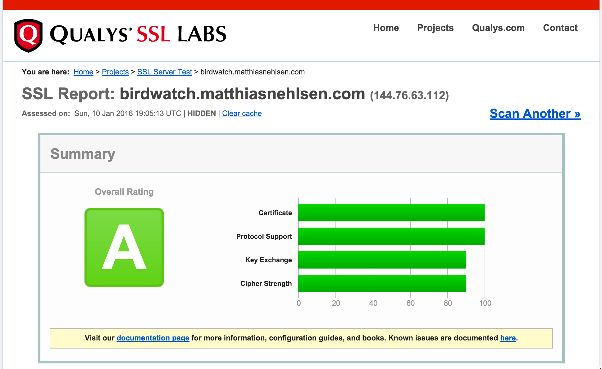

# Running Birdwatch with TLS

While it may not seem important to run a toy application such as this one over a secure connection, it surely is inevitable for any commercial system to make the transport between client and server as secure as possible. The **systems-toolbox** now offers support for TLS (including the WebSocket connection) through the **[systems-toolbox-sente](https://github.com/matthiasn/systems-toolbox-sente)** library.

However, in addition to obtaining a certificate and configuring a keystore, the JVM also needs to be configured properly by overriding a few security properties, as can be seen in the `birdwatch.security` file in this folder. These properties are then loaded in `project.clj` as follows:

    :jvm-opts ["-Xmx1G" "-server" "-Djdk.tls.ephemeralDHKeySize=2048"
               "-Djava.security.properties=TLS/birdwatch.security"]

The aforementioned override happens in `"-Djava.security.properties=TLS/birdwatch.security"`. Also, there's another property we want to set to ensure proper size of the ephemeral key used in **[Forward Secrecy](http://vincent.bernat.im/en/blog/2011-ssl-perfect-forward-secrecy.html)**: `"-Djdk.tls.ephemeralDHKeySize=2048"`.

Together, these measures give us an **A rating** in the **[Qualys® SSL Report](https://www.ssllabs.com/ssltest/analyze.html?d=birdwatch.matthiasnehlsen.com)**, which I have found very helpful when optimizing the secure transport layer in this application:

# Using a free certificate from Let's Encrypt

Creating a free & trustworthy certificate from **[Let's Encrypt](https://letsencrypt.org/)** was relatively straightforward. On my server, I ran the steps as described on their **[How It Works](https://letsencrypt.org/howitworks/)** page:

    $ git clone https://github.com/letsencrypt/letsencrypt
    $ cd letsencrypt
    $ ./letsencrypt-auto --help

Then, I ran the following:

    ./letsencrypt-auto certonly --standalone --standalone-supported-challenges \
    tls-sni-01 -d matthiasnehlsen.com -d birdwatch.matthiasnehlsen.com

This resulted in four different files, of which I only needed `privkey.pem` and `fullchain.pem`. Now the JVM cannot deal with these files directly, so I needed to convert them in two steps:

    openssl pkcs12 -inkey privkey.pem -in fullchain.pem -export -out mn.pkcs12
    keytool -importkeystore -srckeystore mn.pkcs12 -srcstoretype PKCS12 -destkeystore keystore.jks

The second command then generated the `keystore.jks` file, which is ready for use by this application. For that, I have stored it in the `./TLS/` folder. In order to start up the application, two to three environment variables are then needed:

    SSL_KEYSTORE=TLS/keystore.jks SSL_KEYSTORE_PW=<some-random-password> lein run

This will start the application with TLS enabled on port 8443. If you want a different port, you can also specify the `SSL_PORT`:

    SSL_KEYSTORE=TLS/keystore.jks SSL_KEYSTORE_PW=<some-random-password> SSL_PORT=9443 lein run

Obviously, you will also want to configure `iptables` or whatever you are using for port redirects if you want the application to respond on the normal https port 443.

You can now also run the application in HTTP2 mode. For this, start the application as follows instead:

    SSL_KEYSTORE=TLS/keystore.jks SSL_KEYSTORE_PW=<some-random-password> HTTP2=true lein with-profile http2 run

**HTTP2** required TLS.

# Possible improvements

While I'm quite happy with the **A rating**, I'd like to only use ciphers with **Forward Secrecy** enabled. However, I have not found a way to specify the ciphers directly, I have rather narrowed them down as much as possible. Another quite helpful tool in the process was **[TestSSLServer](http://www.bolet.org/TestSSLServer/)** and this reveals the following ciphers that are still available:

    $ java -jar TestSSLServer.jar localhost 9443
    Supported versions: TLSv1.2
    Deflate compression: no
    Supported cipher suites (ORDER IS NOT SIGNIFICANT):
      TLSv1.2
         TLS_RSA_WITH_AES_128_GCM_SHA256
         TLS_RSA_WITH_AES_256_GCM_SHA384
         TLS_DHE_RSA_WITH_AES_128_GCM_SHA256
         TLS_DHE_RSA_WITH_AES_256_GCM_SHA384
         TLS_ECDHE_RSA_WITH_AES_128_GCM_SHA256
         TLS_ECDHE_RSA_WITH_AES_256_GCM_SHA384
    ----------------------
    Server certificate(s):
      e374dcb389de9121bfdc38d8ace0b5bfadbeb602: CN=matthiasnehlsen.com
    ----------------------
    Minimal encryption strength:     strong encryption (96-bit or more)
    Achievable encryption strength:  strong encryption (96-bit or more)
    BEAST status: protected
    CRIME status: protected

If you have an idea how to disable `TLS_RSA_WITH_AES_128_GCM_SHA256` and `TLS_RSA_WITH_AES_256_GCM_SHA384`, please don't hesitate to submit a PR or otherwise get in touch.

Cheers